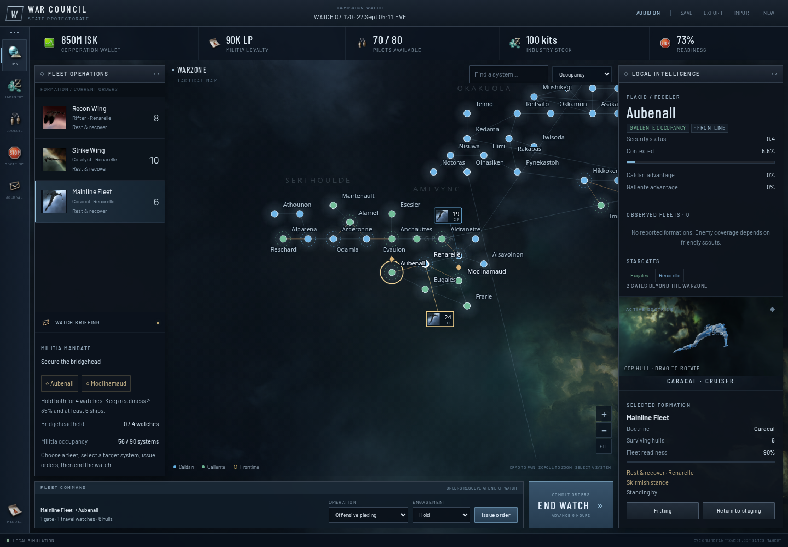

# EVE: War Council

A playable, single-player, browser-only strategy game about the Caldari–Gallente Faction Warfare warzone. Command your corporation’s fleets, fund independent allies, manufacture replacements, and keep pilots willing to undock.

The interface uses EVE-inspired window chrome, original colored Neocom icons, official portraits and logos, actual CCP ship geometry, and a genuine EVE nebula cubemap. All runtime resources are local. No application server, account, API key, build step, or live EVE connection is needed.



## Play

**[Play EVE: War Council](https://cyberbalsa.github.io/eveonline-fwsim/)** · [GitHub repository](https://github.com/cyberbalsa/eveonline-fwsim)

To play locally, serve this folder over HTTP; opening `index.html` as a file will not load the scenario correctly.

```sh
python3 -m http.server 8091
```

Open **http://localhost:8091/**. Choose Caldari or Gallente, name your commander and corporation, and enter the warzone.

1. Select a formation and an enemy objective system.
2. Choose **Offensive plexing**, select a stance, and **Issue order**.
3. **End watch** resolves both sides together. Ships follow real stargate routes.
4. When a system becomes vulnerable, issue **Assault I-Hub**. Ownership transfers after hub destruction and scheduled downtime.
5. Keep your force supplied through **Industry**, assign reserve ships in **Fleet Fitting**, and fund joint operations in **Council**. Rest tired pilots.

Capture both bridgehead targets and hold them for four watches with readiness at least 35% and six surviving hulls. The standard campaign has a 120-watch limit, with 48- and 180-watch options. Victory can occur before the limit. The in-game handbook explains the mechanics.

Actions autosave to this browser. **Export** creates a portable campaign file; **Import** validates it before replacing the current campaign. Starting or importing another campaign preserves the prior browser save under `eve-war-council-campaign-v1-backup`. Saves are local to the current browser and origin; export before clearing browser data or changing hosts.

## Implemented first version

- All **90 warzone systems and 110 internal gates**, real schematic positions, pan/zoom/search, occupancy/frontline/supply views, fog-filtered fleet counters, and system inspection.
- Five combat doctrines, eight orders, four engagement stances, travel, combat losses, withdrawal, site pressure, advantage, infrastructure hub assaults, and delayed ownership transfers.
- Independent corporation AI with separate finite wallets, reserves, attendance and strategic objectives. Real corporation/alliance names, logos and verified public character portraits appear in the council.
- Manufacturing, procurement, material freight, capped LP settlement, reserve hangars, fleet formation/refitting, training, institution upgrades, morale, fatigue and coalition commitments.
- Timed relocation of reserves and unfinished production, plus emergency evacuation from captured staging. A wiped force can return its pilots and rebuild.
- Seeded deterministic campaigns, portable validated saves, operations and wallet journals, campaign outcomes, and responsive desktop/mobile controls.
- Real 3D ship previews with keyboard/pointer orbit, reduced-motion support and an official painted-render fallback. Locally cached EVE interface sounds can be muted.

This is the first playable slice of the [larger PRD](PRD.md), not every proposed feature. [Implementation scope and adaptations](design/implementation.md) distinguishes working rules from future content.

## Fidelity and research

The opening ESI cache was last modified **22 September 2026 at 05:11:32 UTC**, before downtime: **56 Caldari-held and 34 Gallente-held systems**. Geography comes from the Risk project’s frozen ESI/SDE evidence and was checked internally; no complete fresh gate-by-gate audit is claimed. There are also 31 outgoing gates to 27 external destinations, recorded but outside the playable theater.

Geography, opening occupancy and identities are dated observations. Six-hour watches, fleet coefficients, prices, recipes, resources, participation and NPC behavior are authored adaptations. This is an alternate-history simulation, not a claim to reproduce private player motives, current fitted assets, future decisions, or the full MMO one-to-one.

- [Game design PRD](PRD.md) and [research guide](research/README.md).
- [Mechanics](research/01-fw-mechanics.md), [history and politics](research/02-history-politics.md), and [game theory/economy/AI](research/03-theory-economy-ai.md).
- [Source index](research/SOURCES.md): 130 claim records / 124 distinct URLs, with dated evidence and uncertainty labels.
- [Warzone snapshot](data/warzone-snapshot.json), [map](research/warzone-map.svg), and [identity gallery](research/identity-gallery.html).
- [Freeciv source audit](research/06-freeciv-evaluation.md). Rules/map/turn separation and observation boundaries informed the design; no Freeciv engine code is bundled.

## Development and verification

Node is only required for tests. Runtime uses native browser modules and the checked-in local renderer bundle.

```sh
npm ci
npm test
npx playwright install chromium  # once, if not installed
npm run test:e2e
npm run validate:research
```

Node tests cover capture chronology, finite inventory, production and logistics, fog, deterministic replay, attendance, NPC campaigns, recovery and asset provenance. Browser tests exercise the actual industry, council, fitting, map, orders, saves and mobile controls. The E2E config packages the site and starts a static server on port 8091, testing `/eveonline-fwsim/` to match the GitHub Pages project path. Stop any existing server on that port before running the tests.

## Publishing

The [Pages workflow](.github/workflows/pages.yml) runs the engine, asset, research and browser checks on pushes and pull requests to `main`. Successful pushes to `main` deploy automatically. The repository's **Settings → Pages → Source** must be **GitHub Actions**.

`npm run build:pages` copies the game, local assets and supporting documentation into `_site/eveonline-fwsim/`. This is the deployment artifact; dependencies, tests and tooling are excluded. The same artifact is tested before uploading. Packaging does not compile or change the game's browser modules.

To run the browser checks against the live site:

```sh
PLAYWRIGHT_BASE_URL=https://cyberbalsa.github.io/eveonline-fwsim/ npm run test:e2e
```

Key files: `rules.js` holds the tuning and roster; `engine.js` owns state/actions/AI/resolution; `game.js` binds the interface; `map.js` draws the real graph; `styles.css`, `map.css`, and `game-ui.css` theme it. `ship-viewer.js` loads the licensed local renderer bundle. [Asset provenance and optional rebuild instructions](ASSETS.md).

Research utilities use the Python standard library:

```sh
python3 scripts/build-source-index.py
python3 scripts/analyze-warzone.py
python3 scripts/validate-research.py
```

The [original design-as-data proposal](design/ruleset-proposal.json) remains a research artifact. Implemented rules live in `rules.js` and `engine.js`.

EVE Online and its artwork belong to CCP hf.; this is an unofficial non-commercial fan prototype. [Credits and terms](CREDITS.md).
