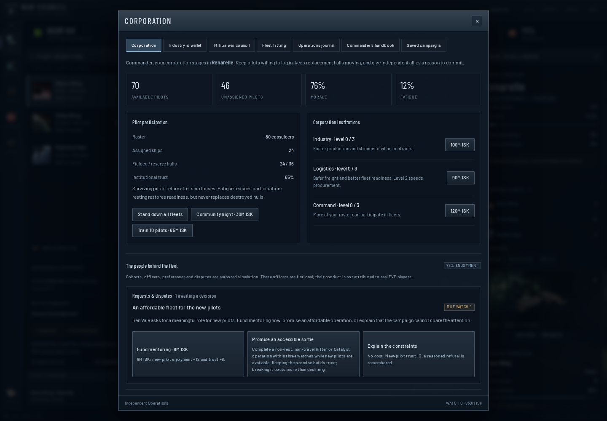

# Managing the people behind the fleets

Open **OPS** for your corporation's pilots and **Council** for independent allied organizations. The main watch briefing highlights up to three requests or offers that need attention.

## Your corporation

Six groups care about different parts of the war: new pilots, small-gang hunters, campaign veterans, industrialists, support volunteers, and income-focused pilots. Their enjoyment, trust and fatigue change as watches resolve. Their willingness to participate affects how many ships can be crewed. Sustained dissatisfaction can cause unassigned volunteers to leave.

Use protected rest to let a group sit out two watches, or spend 4M ISK to recognize its contribution. Recognition has a four-watch cooldown. Officer development takes three watches and costs 18M ISK for the first program, then 36M for the next. Fleet organizers ease workload and help turnout; logistics coordinators support tired organizers and resting formations; mentors make affordable operations more rewarding for new pilots.

Your policies have tradeoffs:

- **Doctrine access:** accessible, mixed, or specialist emphasis changes which groups enjoy your actual fleet operations.
- **Participation:** optional fleets reduce turnout and workload; strategic call-ups raise turnout but accumulate fatigue and cost trust.
- **Loss assistance:** reimburse 0, 2M, or 4M ISK per lost hull, bounded by 24M per watch and available cash. This pays pilots; it does not create replacement ships.

Requests and officer disagreements give you explicit choices. You may spend money, change priorities, explain constraints, or promise an operation. The affordable-sortie promise requires a Rifter or Catalyst to complete useful work by the stated watch. Simply issuing an order does not satisfy it. Ignoring a request damages trust; accepting and then breaking a promise has a larger consequence. Memories explain what happened.

The three officers are fictional characters in your corporation. Real EVE characters remain sourced liaisons in the council; the game does not claim that generated personalities or decisions describe those players.

## Independent allies

The existing joint-operation button provides a standard funded request. The negotiation controls let you propose a different contribution. An ally can accept, make a counteroffer, or explain why it cannot support the plan. A counteroffer moves no money until you accept it and expires after three watches. The ally's forces, recovery needs, travel distance and unresolved disputes influence feasibility and price.

| Agreement | What it does |
|---|---|
| Joint operation | Funds an eight-watch objective; the ally keeps its own tactical and withdrawal decisions. |
| Defensive compact | Buys one response during twelve watches when a friendly system reaches 25% pressure. Existing commitments or an exhausted force can delay the response. |
| Workshop access | Gives resting fleets at the agreed allied staging eight extra readiness points per watch for eight watches. It does not transfer stocks. |
| Replacement assistance | Reserves at least 40M ISK to cover half of an ally's lost hull scenario cost for eight watches. Payments cannot exceed escrow; unused money returns. |

Delivering 20M ISK of aid or completing a joint operation can earn a favor. Calling a favor transfers 20M from the ally's wallet only if it can retain an 80M operating reserve. Both actions have cooldowns.

Favoring one organization can create scheduling disputes with another. Mediation reduces rivalry and grievances. Two consecutive watches of severe grievances or lost trust can cause coalition withdrawal. The corporation remains in its militia and continues pursuing its own objectives, but stops accepting coalition orders. Reconciliation becomes possible after two watches and must restore enough trust while resolving grievances.

## Keeping your campaign

**SAVE** opens a manager that stores up to twelve named copies locally. Loading validates the selected save and backs up the current campaign before replacing it. Portable **Export** and **Import** still work, and campaigns from the first release automatically gain the new systems without resetting their assets or watch.

The journal searches up to 2,000 retained entries and displays one page at a time. Export it to keep a separate copy of that history. When the campaign ends, **Continue in sandbox** preserves its final report and resumes the same war without another mandate deadline.

Combat forecasts appear with the selected fleet. They explain pilot coverage, travel time, observed opposition and uncertainty. An unscouted target stays unknown even though the single-player simulator must hold the full world state internally.
